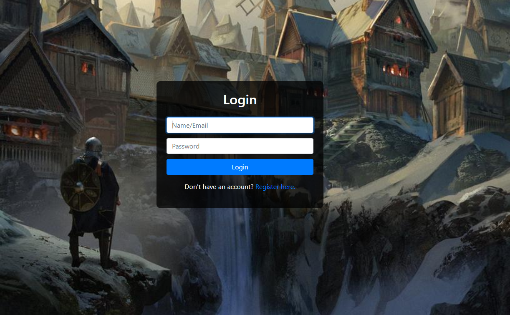
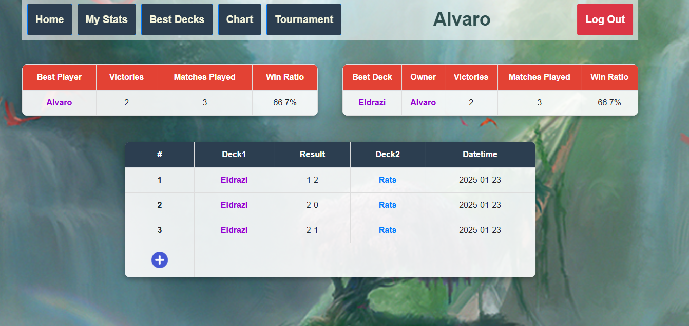
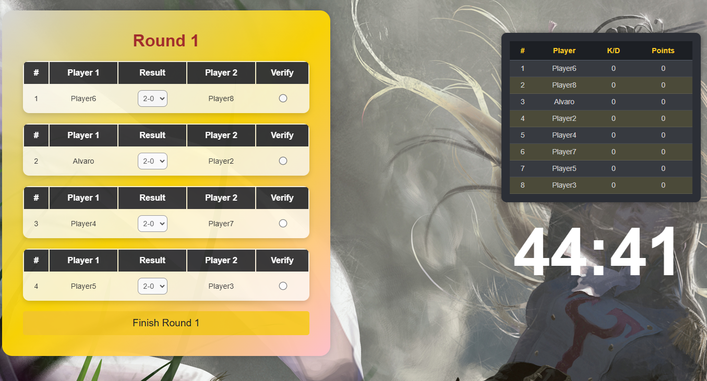

# MTG STATS - WIP
MTG STATS is a web application built using Django, React, HTML, CSS, and JavaScript. The application provides
a platform for players to see their performance, create and manage decks. It also features a tournament system 
where players can compete in 8-player tournaments and view detailed statistics and rankings.

## Features
### User Management
- Register/Login: Users can create an account or log in if they already have one.

- Profile Stats: View personal stats, including wins, losses, and detailed performance metrics.
- 
### Deck Management
- Create and Manage Decks: Players can create one or more decks.
- Deck Statistics: Track general stats for each deck, including wins/losses and performance against specific opponents' decks.
### Plots
- Players can visualize their performance/ranking visually

### Tournaments
- 8-Player draft: Organizer of a structured tournament.
- Ranking and Matchmaking: Players are matched according to their points, and rankings are updated dynamically.
- Tournament Details: View ranking, time of matches, and progress throughout the tournament.

## Tech Stack
### Backend
- Django: Used for server-side logic, database management, and API development.
### Frontend
- React: Provides a dynamic and interactive user interface.
- HTML/CSS: Used for static design and styling.
### Database
- Django ORM: Handles database interactions.
